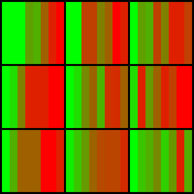
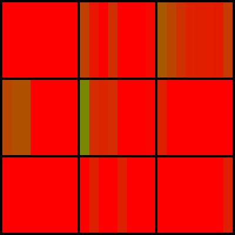
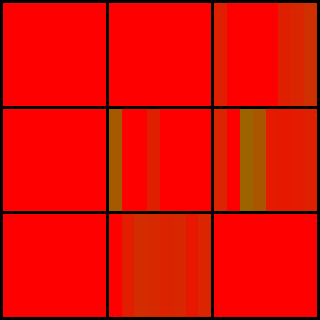

# LLM-Evals

Repository to explore building custom LLM evaluations.

## Spatial Context Evaluation: Patches

The Needle in a Haystack evaluation shows how models fail to extract information in particular areas of the context as the context size grows. I wanted to design a similar evaluation for spatially constructed prompts. Many LLM use cases leverage structured data like tables and string representations of arrays. This data has clear spatial structure, and we can create evaluations to determine the ways these systems fail at extracting
simple information from those structures such that we can try and improve these systems.

The image below is the result of the "Patches" evaluation for Claude Opus.

You can read the eval left-to-right. Each square corresponds to a spatial area in a grid that is part of the prompt. The left most vertical line in the square is for the smallest grid size tried, the right most vertical line in the square is for the largest grid size tried. As you can see, Claude's performance (calculated as precision) decays as grid size grows. Furthermore, it decays differently in each patch, favoring top left and bottom right. The evaluation is structured as follows:

Provide the LLM with a grid of characters. Then provide a grid of the same size with numbers.

<table>
<tr>
<td valign="top">

|   |   |   |   |   |   |   |   |   |
|---|---|---|---|---|---|---|---|---|
| a | a | a | b | b | b | c | c | c |
| a | a | a | b | b | b | c | c | c |
| a | a | a | b | b | b | c | c | c |
| d | d | d | e | e | e | f | f | f |
| d | d | d | e | e | e | f | f | f |
| d | d | d | e | e | e | f | f | f |
| g | g | g | h | h | h | i | i | i |
| g | g | g | h | h | h | i | i | i |
| g | g | g | h | h | h | i | i | i |

</td>
<td width="100">&nbsp;</td> <!-- Adjust width for larger space -->
<td valign="top">

|   |   |   |   |   |   |   |   |   |
|---|---|---|---|---|---|---|---|---|
| 0 | 0 | 1 | 8 | 5 | 7 | 4 | 1 | 4 |
| 0 | 7 | 1 | 4 | 9 | 6 | 5 | 5 | 8 |
| 2 | 6 | 8 | 6 | 5 | 1 | 2 | 9 | 5 |
| 3 | 4 | 6 | 5 | 7 | 2 | 6 | 4 | 9 |
| 1 | 1 | 5 | 5 | 7 | 4 | 9 | 5 | 1 |
| 1 | 9 | 1 | 9 | 2 | 0 | 2 | 6 | 4 |
| 8 | 6 | 4 | 6 | 9 | 4 | 1 | 4 | 8 |
| 1 | 9 | 6 | 6 | 2 | 9 | 0 | 2 | 4 |
| 5 | 5 | 1 | 2 | 0 | 6 | 4 | 6 | 6 |

</td>
</tr>
</table>

Ask a question about this grid (currently I implemented this as just "what patch is number X in?" where I guarantee there is only one X in the grid) in which the answer is definitively a character in the patch. For example, the correct answer to "what patch is number 3 in?" for the grids above is `d`.

Since there is such a definitive (and lovely that it's only one token) answer, we can easily generate these grids of growing sizes, and look at the performance of the LLM to answer the question to see if that performance has any differences in particular spatial areas.

If you would like to run this evaluation yourself, you can do so with `python llm_evals/spatial/patches/run_eval.py --n_samples 8 --patch_size_end 8 --model claude-3-opus-20240229`.

Smaller models like Claude Haiku and GPT-3.5-Turbo are currently very poor at this eval as can be seen by their results below (haiku is on the left, gpt3.5 on the right):

 

## . . . More Evals to Come . . .
